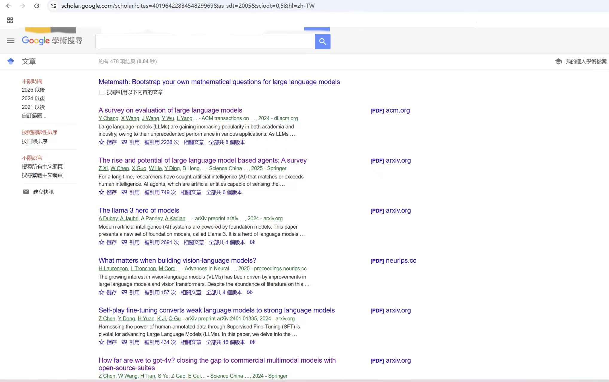

# MedianTools

该工具适用于MedianGroup citation ppt制作，使用selenium从google scholar前端网页抓取数据，可以保证检索到文章信息与google scholar一致


## <u>2025/02/25 update</u>

- 支持根据引用标号查询原文，如

```
In Obedience to Authority: An Experimental View, 1974.1IntroductionLarge language models (LLMs) have shown great success in various tasks [24, 50, 60, 14, 15, 46,32, 68, 72].
```

详见  *extract_fromPDF.py*  


## 2025/02/24 update

- 优化**根据作者姓名查找主页**逻辑，准确率**大幅提高**


## 2025/02/23 update

- 支持arxiv文章pdf批量下载
- 支持根据作者姓名(如 Yu et al.)查找引用原文

## Important

在google scholar中搜索引用该文章的所有文章，例如检索<u>MetaMath</u>可以看到所有478篇文章

复制该url，到tools.ipynb中,浏览器自动打开后,需要放大至最大窗口,否则 ***下一页***  按钮不会出现 



下面方法中的api_key需要自行注册获取   https://serper.dev

```python
get_author_homepage(author,api_key="xxxx")
```


## TODO

目前支持如下来源文章的作者数据自动获取，其他网站暂不支持需要手动检索作者姓名补充加入csv中，若有出现频率较高但不在此列的网站，欢迎完善代码

- arxiv.org
- ieee.org
- OpenReview
- NeurIPS
- ACL Anthology

