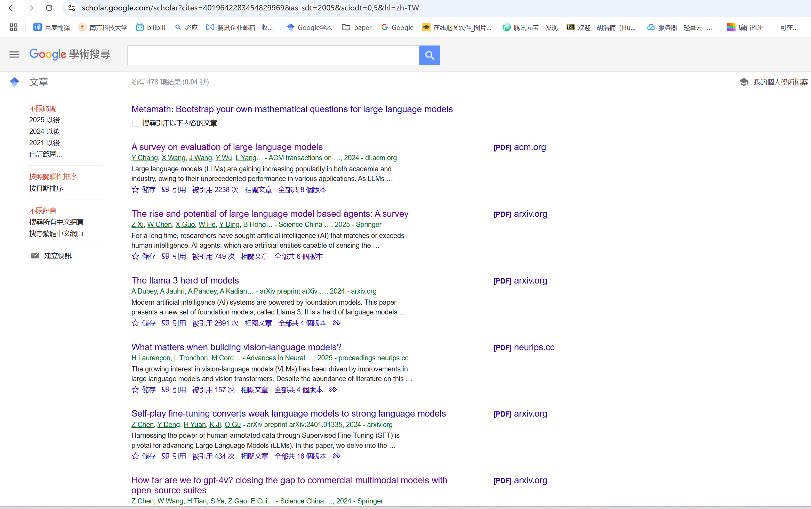

# MedianTools

该工具适用于MedianGroup citation ppt制作，适用selenium从google scholar前端网页抓取数据，可以保证检索到文章信息与google scholar一致


**<u>目前支持自动下载arxiv文章pdf，以及获取部分文章引用原文</u>**


## Important

在google scholar中搜索引用该文章的所有文章，例如检索<u>MetaMath</u>可以看到所有478篇文章

复制该url，到tools.ipynb中,浏览器自动打开后,需要放大至最大窗口,否则 ***下一页***  按钮不会出现 



下面方法中的api_key需要自行注册获取   https://serper.dev

```python
get_author_homepage(author,api_key="xxxx")
```


## TODO

目前支持如下来源文章的作者数据自动获取，其他网站暂不支持需要手动检索作者姓名补充加入csv中，若有出现频率较高但不在此列的网站，欢迎完善代码

- arxiv.org
- ieee.org
- OpenReview
- NeurIPS
- ACL Anthology

